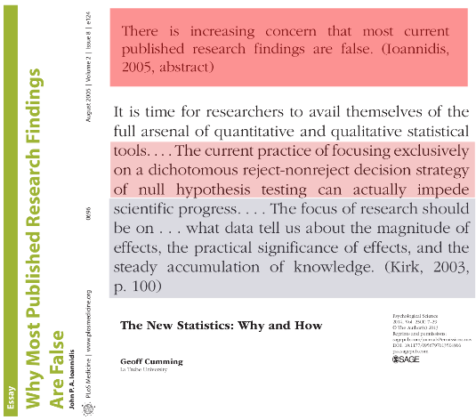
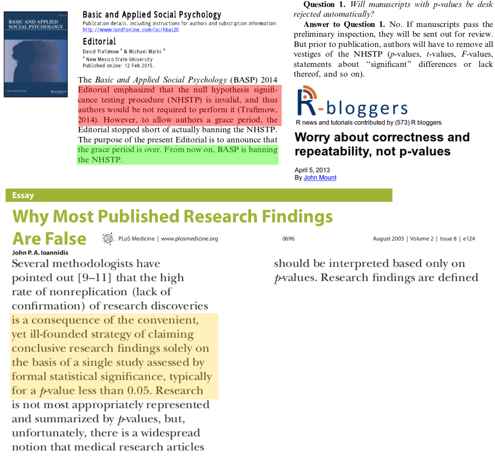

`r knitr::opts_chunk$set(echo = FALSE, warning = FALSE, error = FALSE, message = FALSE)`

```{r}
seed <- 3
source("presWork.R", echo = F)
```

```{r}
ss25 <- simBin(pa = 0.5, pb = 0.6, nSamp = 25, nSim = 1000)
ss50 <- simBin(pa = 0.5, pb = 0.6, nSamp = 50, nSim = 1000)
ss100 <- simBin(pa = 0.5, pb = 0.6, nSamp = 100, nSim = 1000)
ss500 <- simBin(pa = 0.5, pb = 0.6, nSamp = 500, nSim = 1000)
ssMA <- simMA(vSampSize = c(50, 100, 200), nTrials = 15, pa = 0.5, pb = 0.6)
```

# Background

## 80% of results of all published research are "FALSE"



## Huge problem of results not holding good on replication

- Wastage of resources: patients, time, money

- Wrong, sometimes fatal clinical decisions **(Ethical issues)**

## Reasons for the "FALSE" results

> - Human emotion
    - Bias by researcher: Hiding data, analyses and results
    - Bias by editorial staff: Preferential publication of positive results
    - Positive results are linked with professional growth
    
> - Lack of replication of studies

> - **Mis-interpretation of statistical results**
    - Commonest one: *P VALUE*
    
## The problem is so rampant that ...



## Actual meaning of "p value"


- Actual meaning: Probability that the evidence in question or more extreme belongs to the population depicted by null hypothesis given null hypothesis is true (complicated concept!!)

## p value < 0.05: THE MAGICAL EXPRESSION

> - DISCRIMINATOR FOR ASSESSING SIGNIFICANCE: The ill defined and often non relevant statistical significance.

> - **"p value of difference in mean in reduction in fasting blood sugar levels between drug A (mean 34 mg/dl) and drug B (mean 36 mg/dl) is 0.001 (< 0.05)"**
    - *Drug B is significantly better than drug A*
    
> - **"p = 0.056"**
    - *Drug B is not better than drug A and researcher does his best to reduce p value to less than 0.05*
    
> - **"p = 0.01 is better discriminator than p = 0.046"**
    - *Lesser the p value, better it is as discriminator*

## Aims of this presentation

- Provide alternatives to p value

- Provide more informative ways to interpret and report results from research

## Scenario to be discussed in presentation

- Comparative intervention trial

- Intervention A vs Intervention B

- Outcome of interest: **proportion of developing a given outcome** within a **period of time**

- Our aim is to **compare** Intervention A and Intervention B
    - Difference in proportion *(Risk difference)*
    - Ratio of proportion *(Risk ratio)*
    - Ratio of odds *(Odds ratio)*

# Q 1: Comparability of populations

## Is population being tested in trial comparable to our population?

- Patient characteristics

- Environment around patients (in hospital and around the place of living)

- Equality of Supportive care

- Similarity in proficiency of measurement of variables (molecular techniques) and outcomes

# Q 2: Understanding Effect Size

## Effect Size

- **Most important** number we should care of

- Population characteristic
    - Usually we can only estimate it from the sample
    
- **One population**
    - Mean/median of WBC
    - Proportion surviving at the end of 1 year (OS)
    - Incidence rate (Hazard) of relapse over 1 year
    - Cumulative incidence of relapse over 1 year
    
- **Two populations** (comparision)
    - **Difference (Absolute and relative)**
    - Ratio (Hazard ratio, Odds ratio, Risk ratio)

## Example (Difference in proportions)

\begin{block}{Example 1}
Intervention A (standard of care) and intervention B are given over a period of \textbf{1 month}. At the end of \textbf{1 year}, 50\% of patients in intervention A and 60\% of patients in intervention B arm are in remission.
\end{block}

\begin{block}{Example 2}
Intervention A (standard of care) and intervention B are given over a period of \textbf{1 year}. At the end of \textbf{5 years}, 2\% of patients in intervention A and 1\% of patients in intervention B arm relapse.
\end{block}

> Is Intervention B better than intervention A (standard of care)?. We will use difference in proportion as our \textbf{Effect Size Measure}.

## Relative vs absolute difference in proportion

> - **Relative risk difference (RRD)**
    - *Example 1:* (0.6 - 0.5)\textcolor{red}{/0.5} = 0.2 = *20%*
    - *Example 2:* (0.02 - 0.01)\textcolor{red}{/0.02} = 0.5 = *50%*
    
> - **Absolute risk difference (ARD)**
    - *Example 1:* 0.6 - 0.5 = 0.1 = *10%*
    - *Example 2:* 0.02 - 0.01 = 0.01 = *1%*

> - Usually, **RRD is presented in literature** rather than ARD
    - Inflates the effect size, especially when risks are nearer to zero (Example 2)
    - For example 2, by using intervention B, there is only 1% decrease in relapse (in absolute term), but 50% reduction in relapse, when compared to intervention A

## Clinically relevant effect size

- Needs to be defined by user

- Requires thorough knowledge of subject area, expertise and environment

- Example 1: Say, the disease concern is an indolent and non life threatening disease. Improvement of remission rate to 10% may not be clinically relevant

## ARD and NNT

- **Number Needed to Treat (NNT) = 1/ARD**

- Very useful effect size measure

- **Example 1:** _NNT = 10_

- **Example 2:** _NNT = 100_

> - We need to treat _10 patients_ to get 1 extra remission at the end of _1 year_ (Example 1) and _100 patients_ to prevent 1 extra relapse at the end of _5 years_ (Example 2).
    - If I get 10 patients of the disease in Example 2 in my centre in a year, I will have to wait for 10 years to get one extra remission after waiting for 5 years (i.e., from 6^{th} to 16^{th} year)
    - \textcolor{red}{Is intervention B really better for me at my centre??}

# Q 3: Estimating Effect Size

## Population vs Sample

- \textcolor{red}{We donot know the real Effect Size} as it is a population characteristic
    
- We can only estimate it from **Random Sample** chosen from the underlying population by **carrying out experiments**

# Q 4: Quality of Effect Size Estimate

## Three qualities

- **Validity** of estimate
    - Difference in estimate and actual effect size (Bias)

- **Magnitude** of estimate
    - Greater the magnitude, better it is.
  
- **Precision** of estimate (denoted by Confidence Interval)
    - Greater the precision, better it is

# Q 4a: Validity of effect size estimate (Problem of CONFOUNDERS)

## Are groups intervention A and intervention B equal in all respects other than the interventions?

> - **Baseline known confounders** are equal between both groups
    - If not, are they taken care of statistically (Multiple regression analysis, stratified analysis)?

> - **Baseline unknown confounders** are equal between both groups
    - Only way to take care of is by **appropriate randomisation** (randomised allocation of treatment ensures confounders to be distributed equally in both the groups)

> - **Blinding** of allocation of intervention arms, taking care of patients, measuring outcomes, performing statistical analyses
    - To maintain equality among both the groups till publishing the results

## (contd ...)

> - Equality of **loss to follow up or cross over** between both groups: numbers and reasons
    - Intention to Treat vs Per Protocol analysis

> - RCTs yield more valid estimate of Effect Size than observational studies (Cohort, Case Control studies)

# Q 4c: Understanding Precision

## Simulation

> We simulate example 1. Clinically relevant difference between both groups is 0.1. We will draw random samples from population treated with intervention A (prob of remission 0.5) and population treated with intervention B (prob of remission 0.6) 1000 times (equivalent as carrying out 1000 trials). We will compare intervention A and intervention B by difference of proportion.

## Simulation: probA: 50%, probB: 60%, sample size: 25

```{r}
plot(ss25)("withoutCI")()
```

## Simulation: probA: 50%, probB: 60%, sample size: 50

```{r}
plot(ss50)("withoutCI")()
```

## Simulation: probA: 50%, probB: 60%, sample size: 100

```{r}
plot(ss100)("withoutCI")()
```

## Simulation: probA: 50%, probB: 60%, sample size: 500

```{r}
plot(ss500)("withoutCI")()
```

## Explanation of simulation

> - The **blue** lines, which denote the **bound for mid 95% of all the estimates** is the measure of **Precision**, the width of which is the width of corresponding confidence interval

> - The precision increases (width of the distribution decreases) with increasing the sample size

## Understanding Confidence Interval

\begin{figure}
\centering
\includegraphics[width=0.6\textwidth]{fig/figD.png}
\end{figure}

- Width of LCL - UCL, dependent on **variability** of sample and **sample size**

- Any of the points bounded by LCL and UCL can be the **Population Effect Size** (with 95% certainty)

## Understanding clinically relevant regions

\begin{figure}
\centering
\includegraphics[]{fig/figE.png}
\end{figure}

# Various positions of CI

## Scenario 1

\begin{figure}
\centering
\includegraphics{fig/scen1.png}
\end{figure}

- The population effect size is more than 0 and clinically significant effect size (Intervention B is definitely clinically better to Intervention A)

## Scenario 2

\begin{figure}
\centering
\includegraphics{fig/scen2.png}
\end{figure}

- The population effect size is more than 0 and but may not be more than clinically significant effect size (Intervention B is better than intervention A but may not be clinically relevant).

## Scenario 3

\begin{figure}
\centering
\includegraphics{fig/scen3.png}
\end{figure}

- The population effect size crosses 0, **we cannot say that B is better than A**. We can say that B is **not inferior** to A. We should not say that B is not better than A, we need to be **more precise.**

- \textcolor{red}{Absence of evidence that a fact is true does not mean that fact is not true.}

## Scenario 4

\begin{figure}
\centering
\includegraphics{fig/scen4.png}
\end{figure}

- We are not sure that B is not inferior to A. We are sure that B is not better than A in a clinically relevant manner.

## Scenario 5

\begin{figure}
\centering
\includegraphics{fig/scen5.png}
\end{figure}

- We are sure that B is not better than A

## Scenario 6

\begin{figure}
\centering
\includegraphics{fig/scen6.png}
\end{figure}

- We are sure that B is inferior to A

## Scenario 7

\begin{figure}
\centering
\includegraphics{fig/scen7.png}
\end{figure}

- B is equivalent in effect to A

## Finally, Importance of Replication of Experiments

```{r}
rr <- rma(ai = succB, ci = succA, n1i = nB, n2i = nA, data = ssMA, measure = "RD", slab = paste0("Study-", 1:nrow(ssMA), ": n=", nA), method = "REML")
```

```{r fig.height=6}
forest(rr)
```

- We are **more certain about the population effect size.** Miniscule confidence interval

- Interpretation of effect size depends on us.

# Manipulating CI

## Simulation with CI: probA: 50%, probB: 60%, sample size: 25

```{r fig.height=5}
plot(ss25)("withCI")(40)
```

- Proportion of experiments failing to include population effect size in CI (Alpha Error): `r ss25$input$alphaErr`

- Proportion of experiments failing to show difference between both groups (Beta Error): `r 1 - ss25$input$power`

## Simulation with CI: probA: 50%, probB: 60%, sample size: 50

```{r fig.height=5}
plot(ss50)("withCI")(40)
```

- Proportion of experiments failing to include population effect size in CI (Alpha Error): `r ss50$input$alphaErr`

- Proportion of experiments failing to show difference between both groups (Beta Error): `r 1 - ss50$input$power`

## Simulation with CI: probA: 50%, probB: 60%, sample size: 100

```{r fig.height=5}
plot(ss100)("withCI")(40)
```

- Proportion of experiments failing to include population effect size in CI (Alpha Error): `r ss100$input$alphaErr`

- Proportion of experiments failing to show difference between both groups (Beta Error): `r 1 - ss100$input$power`

## Simulation with CI: probA: 50%, probB: 60%, sample size: 500

```{r fig.height=5}
plot(ss500)("withCI")(40)
```

- Proportion of experiments failing to include population effect size in CI (Alpha Error): `r ss500$input$alphaErr`

- Proportion of experiments failing to show difference between both groups (Beta Error): `r 1 - ss500$input$power`

## We learnt about ...

- **Alpha error:** Proportion of times when CI **fail** to include the **population effect size**
    - Usual value: 0.05

- **Beta error:** Proportion of times when CI include **effect size of null hypothesis (0)**
    - Usual value: 0.20

- **Power** of study *(1 - Beta error)*: Proportion of times when CI **do not** include **effect size of null hypothesis (0)**

## Steps to increase power of study

\begin{figure}
\centering
\includegraphics[width=0.7\textwidth]{fig/power.png}
\end{figure}

## To summarise, interpretation of study results means

- Similarity of population depicted in study with ours

- Understanding relevant effect size

- Ascertaining equality of groups A and B (Tackling Bias)

- Understanding position and precision of effect size estimate

## THANK YOU

### Acknowledgements

1. R Core Team (2014). R: A language and environment for statistical
  computing. R Foundation for Statistical Computing, Vienna, Austria. URL
  http://www.R-project.org/
  
2. ggplot2, metafor packages.

Presentation available at <https://github.com/sumprain/blog/tree/master/aiims_presentation>
