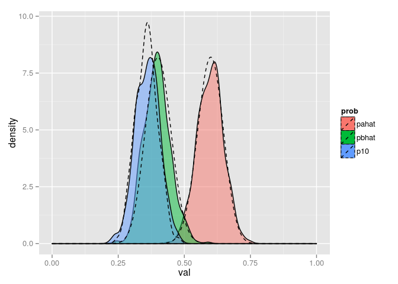
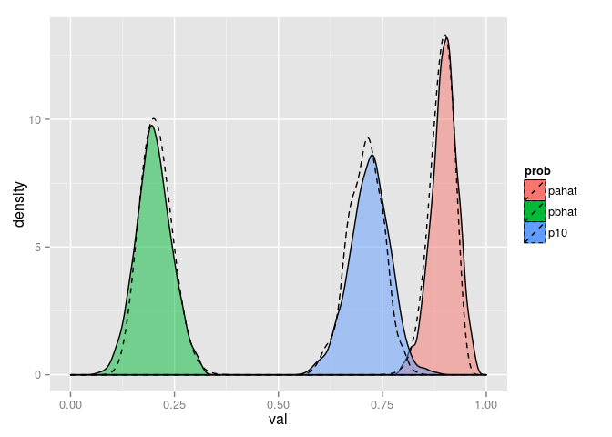

# Alternative measure to compare difference between performance between two interventions


```r
# Functions to be used in the simulation

calcCI <- function(x, ci = 0.95) {
  int <- c(0.5*(1 - ci), 0.5, ci + 0.5*(1 - ci))
  e <- quantile(x, int)
  names(e) <- c('lcl', 'median', 'ucl')
  return(e)
}

genAlphaBeta <- function(p, size, ifProb = T) {
  if (ifProb) {
    succ <- p*size
  } else succ <- p
  alpha <- succ + 1
  beta <- size - succ + 1
  return(c(alpha = alpha, beta = beta))
}

genDensityP <- function(p, sampSize) {
  cf <- genAlphaBeta(p, sampSize)
  x <- seq(0, 1, by = 0.001)
  y <- dbeta(x, cf['alpha'], cf['beta'])
  return(data_frame(x = x, y = y))
}

simDensityP10 <- function(pa, pb, sampSize, nsim) {
  
    coefA <- genAlphaBeta(pa, sampSize)
    coefB <- genAlphaBeta(pb, sampSize)
  
    sampPA <- rbeta(nsim, shape1 = coefA['alpha'], shape2 = coefA['beta'])
    sampPB <- rbeta(nsim, shape1 = coefB['alpha'], shape2 = coefB['beta'])
  
    sampP10 <- sampPA * (1 - sampPB)
  
    return(sampP10) 
}

genSamp <- function(p, size) {
  res <- sample(c(0,1), size, replace = TRUE, p = c(1-p, p))
  return(res)
}


genSampAll <- function(pa, pb, size, nsim) {
  
  densityPBoth <- function(pa, pb, sampSize) {
    
    a <- cbind(genDensityP(pa, sampSize), name = "a")
    b <- cbind(genDensityP(pb, sampSize), name = "b")
  
    return(bind_rows(a, b))
  }
  
  
  simSamp <- replicate(nsim, data_frame(a = genSamp(pa, size), b = genSamp(pb, size)), simplify = FALSE)
  densityP <- densityPBoth(pa, pb, size)
  sampP10 <- simDensityP10(pa, pb, size, nsim)
  res <- structure(list(simSamp = simSamp, densityP = densityP, densityP10 = sampP10), class = "simBeta")
  
  return(res)
  
}

summary.simBeta <- function(obj) {
  
  foo <- function(x) {
    pahat <- sum(x$a)/length(x$a)
    pbhat <- sum(x$b)/length(x$b)
    p10 <- sum(1*((x$a == 1) & (x$b == 0)))/nrow(x)
    return(data_frame(pahat = pahat, pbhat = pbhat, p10 = p10))
  }
  
  res <-  rbind_all(purrr::map(obj$simSamp, foo))
  res$num <- rownames(res)
  res <- tidyr::gather(res, prob, val, -num)
  return(res)
}

print.simBeta <- function(obj) {
  ss <- summary(obj)
  res <- describe(dplyr::select_(tidyr::spread_(ss, "prob", "val"), quote(-num)))
  return(res)
}

plot.simBeta <- function(obj, compWithBeta = TRUE) {
  
  sim <- summary(obj)
  bet <- obj$densityP
  betP10 <- obj$densityP10
  
  if (compWithBeta) {
    ggplot() + geom_density(data = sim, aes(group = prob, x = val, fill = prob), alpha = 0.5) + geom_line(data = bet, aes(group = name, x = x, y = y), lty = "dashed") + geom_density(data = data.frame(betP10 = betP10), aes(x = betP10, fill = NULL), lty = "dashed")
  } else {
    ggplot() + geom_density(data = sim, aes(group = prob, x = val, fill = prob), alpha = 0.5)
  }

}

genP10 <- function(succA, succB, sampleSize, nsim) {
  return(simDensityP10(pa = succA/sampleSize, pb = succB/sampleSize, sampSize = sampleSize, nsim = nsim))
}
```

## Introduction

This post is a sequel to my [earlier post](http://sumanmathmedicine.blogspot.in/2014_07_01_archive.html). The problem to be addressed in this post is that "Is the traditional approach of assessing difference in proportion (both in ways of arithmetic difference and ratio) between intervention A and intervention B as a way to ascertain the performance of intervention A and intervention B appropriate?". This issue is even more pertinent in the field of cancer research (the field of my practice) where a new intervention (intervention being many a times more financially costly than the standard of care) is deemed better than the erstwhile standard of care, because, say the probability of disease relapse decreases from 50% (intervention A, standard of care) to 40% (intervention B, new intervention). Usually the benefit is projected in terms of relative risk reduction, which in this case is (50 - 40)/50 = 20% to make the difference appear much bigger. A better and well established method to depict the difference is the absolute risk reduction ([ARR](http://en.wikipedia.org/wiki/Absolute_risk_reduction)) and equivalently number needed to treat ([NNT](http://en.wikipedia.org/wiki/Number_needed_to_treat)). In the above example, ARR is 10% and NNT is 1/0.1 = 10 (i.e., we need to treat 10 patients with intervention A to prevent one death). Both the above measures correctly depict that the difference between both the interventions are not so big.  NNT is a better measure because it tells us that I need to treat 10 patients to prevent one death. Now, suppose I get on an average, 5 patients of the particular cancer in a year. So, I will have to treat patients for 2 years with the new intervention to prevent on relapse, an effect which will hardly be noticeable in my clinical practice. 

In this post, I will discuss about another measure which, I think, depict the difference between both the intervention in a better way.

## Problem statement

We will be comparing a standard of care intervention (say, intervention A) with a new intervention (say, intervention B).  The outcome of interest will be relapse (adverse outcome, lesser will be better) (1 if relapses or 0 if no relapse). Say, probability with which relapse occurs with intervention A be $p_A$ and intervention B be $p_B$. Assume that $p_A > p_B$, i.e., intervention B is better than intervention A.

Suppose, we treat patient A ($pat_A$) with intervention A and (an identical) patient B with intervention B ($pat_B$). We will call intervention B better than intervention A, when $pat_A$ relapses (1) but $pat_B$ doesnot relapse (0). There will be four outcomes  among both the patients. $pat_A$ = 1 AND $pat_B$ = 0 (outcome of interest), let the probability be denoted as $p_{10}$. Others possible outcomes are $pat_A$ = 1 AND $pat_B$ = 1, $pat_A$ = 0 AND $pat_B$ = 0 and $pat_A$ = 0 AND $pat_B$ = 1, let combined probability be denoted as $\bar{p}_{10}$. We may call that intervention B is better than intervention A only when $p_{10} > \bar{p}_{10}$, or equivalently $p_{10} > 0.5$. We can define $p_{10}$ as follows:

$$
p_{10} = p_A * (1 - p_B)
$$

In the above example, $p_{10}$ = 0.5*0.6 = 0.3, meaning that if we take two patients, one with intervention A and another with intervention B, patient A will relapse and patient B will not relapse only 30% of the times, which is much lesser than the desired probability of 50%. We can see that if $p_A < 0.5$, it is not possible that $p_{10}$ crosses 0.5, however better intervention B performs.  

## How do we estimate $p_A$ and $p_B$?

We estimate $p_A$ and $p_B$ by conducting trial, say randomised clinical trial. We randomly administer intervention A to say $n$ patients and administer intervention B to $n$ patients. Each administration of intervention can be considered as a Bernoulli's trial and outcome of a particular experiment is independent to other outcomes and probability remains the same throughout the recruitment of $n$ patients. If the above assumptions are met (usually so), and $x$ number of patient achieve the outcome out of $n$, probability of achieving outcome (p) will follow

$$
p \sim Beta(x+1, n-x+1)
$$

So,

$$
p_A \sim Beta(x_A+1, n-x_A+1)
$$

$$
p_B \sim Beta(x_B+1, n-x_B+1)
$$

where, $x_A$ and $x_B$ are the number of patients who achieve the outcome of interest among intervention A and intervention B.  $\bar{p}_B = 1 - p_B$ is defined as below:

$$
\bar{p}_B \sim Beta(n-x_B+1, x_B+1)
$$

## Derivation of distribution of $p_{10}$

$p_{10}$ is the product of two probabilities, which are distributed as Beta distribution. The distribution of $p_{10}$ is a complicated one beyond my expertise in mathematics (distribution of product of 2 beta distributed random variables). I will take help of simulation studies to assess the shape of distribution of $p_{10}$. 

We will assume that intervention B is better than intervention A, when the lower limit of 95% confidence interval of $p_{10}$ does not include 0.5.


## Raw simulation

In the raw simulation, for each iteration, I will take $n$ entities from binomial distribution with given $p$ both for intervention A and intervention B. I will estimate the sample probabilities and will also get proportion of times when intervention A achieves outcome but intervention B does not (our outcome of interest).

### Comparing distribution of simulated $p_a, p_b$ and $p_{10}$ with expected distribution

#### $p_a$ = 0.6, $p_b$ = 0.4


```r
r <- genSampAll(pa = 0.6, pb = 0.4, size = 100, nsim = 500)
plot(r)
```

 

#### $p_a$ = 0.9, $p_b$ = 0.2


```r
r <- genSampAll(pa = 0.9, pb = 0.2, size = 100, nsim = 500)
plot(r)
```

 

The simulated values of $p_a$, $p_b$ and $p_{10}$ (solid lines with colored fills) match quite well with the values obtained from the assumed underlying distributions (dashed lines in above figures).

## Real life scenarios

### Scenario 1

We have 100 patients in arm with intervention A and arm with intervention B respectively. 70 patients in intervention A and 40 patients relapsed after a given period of time. We say convincingly that intervention B is better than A if lower limit of $p_{10}$ is more than 0.5.


```r
p10 <- genP10(succA = 70, succB = 40, sampleSize = 100, nsim = 500)
calcCI(p10)
```

```
##       lcl    median       ucl 
## 0.3402728 0.4160065 0.5050153
```

LCL of CI is less than 0.5, meaning that patient with intervention A will relapse and patient with intervention B will not relapse in less than 50% of times, meaning intervention B is not convincingly better than intervention A. We can narrow down the confidence interval by increasing sample size appropriately.

### Scenario 2

We have 100 patients in arm with intervention A and arm with intervention B respectively. 70 patients in intervention A and 20 patients relapsed after a given period of time. We say convincingly that intervention B is better than A if lower limit of $p_{10}$ is more than 0.5.


```r
p10 <- genP10(succA = 70, succB = 20, sampleSize = 100, nsim = 500)
calcCI(p10)
```

```
##       lcl    median       ucl 
## 0.4662700 0.5522691 0.6413893
```

Although median value of $p_{10} > 0.5$, but LCL of CI is less than 0.5. We can narrow down the confidence interval by increasing sample size.

### Scenario 3

We increase sample size to 500 and reconduct the trial. Number of patients who relapsed with intervention A were 350 and 100 patients on intervention B relapsed.


```r
p10 <- genP10(succA = 350, succB = 100, sampleSize = 500, nsim = 500)
calcCI(p10)
```

```
##       lcl    median       ucl 
## 0.5200296 0.5573813 0.5993222
```

Now the LCL is more than 0.5, indicating that we are quite sure that intervention B is superior to intervention A.

## Conclusion

In this post, I have tried another way (more conservative) to determine the superiority of a given intervention over another intervention.

Comments and criticisms are welcome.

Dr Suman Kumar Pramanik (@sumankumarpram1)

## Session information


```r
session_info()
```

```
## Session info--------------------------------------------------------------
```

```
##  setting  value                       
##  version  R version 3.1.2 (2014-10-31)
##  system   x86_64, linux-gnu           
##  ui       X11                         
##  language en_IN:en                    
##  collate  en_IN.UTF-8                 
##  tz       <NA>
```

```
## Packages------------------------------------------------------------------
```

```
##  package      * version    date       source                          
##  acepack        1.3.3.3    2013-05-03 CRAN (R 3.1.1)                  
##  assertthat     0.1        2013-12-06 CRAN (R 3.0.2)                  
##  car          * 2.0.22     2014-11-18 CRAN (R 3.1.1)                  
##  cluster        2.0.1      2015-01-31 CRAN (R 3.1.2)                  
##  colorspace     1.2.4      2013-09-30 CRAN (R 3.0.2)                  
##  DBI            0.3.1      2014-09-24 CRAN (R 3.1.1)                  
##  deSolve      * 1.10.9     2014-06-25 CRAN (R 3.1.1)                  
##  devtools     * 1.6.0.9000 2014-10-04 Github (hadley/devtools@447866d)
##  dichromat      2.0.0      2013-01-24 CRAN (R 3.0.1)                  
##  digest         0.6.4      2013-12-03 CRAN (R 3.0.2)                  
##  dplyr        * 0.4.0      2015-01-08 CRAN (R 3.1.1)                  
##  epicalc      * 2.15.1.0   2012-09-19 CRAN (R 3.0.1)                  
##  evaluate       0.5.5      2014-04-27 Github (hadley/evaluate@0972e3e)
##  foreign      * 0.8.62     2015-01-07 CRAN (R 3.1.2)                  
##  formatR        1.0        2014-08-25 CRAN (R 3.1.1)                  
##  Formula      * 1.1.1      2013-04-04 CRAN (R 3.0.1)                  
##  ggplot2      * 1.0.0      2014-05-21 CRAN (R 3.0.2)                  
##  ggvis        * 0.4        2014-10-04 CRAN (R 3.1.1)                  
##  gridExtra    * 0.9.1      2012-08-09 CRAN (R 3.0.1)                  
##  gtable         0.1.2      2012-12-05 CRAN (R 3.0.1)                  
##  Hmisc        * 3.15.0     2015-02-16 CRAN (R 3.1.1)                  
##  htmltools      0.2.6      2014-09-08 CRAN (R 3.1.1)                  
##  httpuv         1.3.2      2014-10-23 CRAN (R 3.1.1)                  
##  knitr          1.9        2015-01-20 CRAN (R 3.1.2)                  
##  labeling       0.2        2013-06-20 CRAN (R 3.0.1)                  
##  lattice      * 0.20.29    2014-04-04 CRAN (R 3.1.0)                  
##  latticeExtra   0.6.26     2013-08-15 CRAN (R 3.0.2)                  
##  lazyeval       0.1.10     2015-01-02 CRAN (R 3.1.1)                  
##  lubridate    * 1.3.3      2013-12-31 CRAN (R 3.0.2)                  
##  magrittr       1.5        2014-11-22 CRAN (R 3.1.1)                  
##  MASS         * 7.3.37     2015-01-10 CRAN (R 3.1.2)                  
##  memoise        0.2.1      2014-04-22 CRAN (R 3.1.1)                  
##  mime           0.2        2014-09-26 CRAN (R 3.1.1)                  
##  multcomp       1.3.2      2014-02-12 CRAN (R 3.0.2)                  
##  munsell        0.4.2      2013-07-11 CRAN (R 3.0.1)                  
##  mvtnorm        0.9.9997   2014-01-17 CRAN (R 3.0.2)                  
##  mypackage    * 1.0        <NA>       local                           
##  nlme           3.1.119    2015-01-10 CRAN (R 3.1.2)                  
##  nnet         * 7.3.9      2015-02-11 CRAN (R 3.1.2)                  
##  plyr         * 1.8.1      2014-10-04 Github (hadley/plyr@80af6d9)    
##  polspline      1.1.9      2013-11-20 CRAN (R 3.0.2)                  
##  proto          0.3.10     2012-12-22 CRAN (R 3.0.1)                  
##  purrr          0.0.0.9000 2015-02-28 Github (hadley/purrr@eb3512f)   
##  quantreg       5.5        2013-09-23 CRAN (R 3.0.2)                  
##  R6             2.0        2014-08-19 CRAN (R 3.1.1)                  
##  RColorBrewer   1.0.5      2011-06-17 CRAN (R 3.0.1)                  
##  Rcpp           0.11.3     2014-09-29 CRAN (R 3.1.1)                  
##  RCurl          1.95.4.1   2013-03-06 CRAN (R 3.0.2)                  
##  reshape2       1.2.2      2012-12-04 CRAN (R 3.0.1)                  
##  RJSONIO        1.0.3      2013-03-28 CRAN (R 3.0.1)                  
##  rmarkdown      0.4.2      2014-12-22 CRAN (R 3.1.1)                  
##  rms          * 4.3.0      2015-02-16 CRAN (R 3.1.1)                  
##  rpart          4.1.5      2014-01-25 CRAN (R 3.0.2)                  
##  rstudioapi     0.1        2014-03-27 CRAN (R 3.1.1)                  
##  sandwich       2.3.0      2013-10-05 CRAN (R 3.0.2)                  
##  scales         0.2.3      2012-12-05 CRAN (R 3.0.1)                  
##  shiny          0.11       2015-01-17 CRAN (R 3.1.1)                  
##  SparseM      * 0.99       2013-04-24 CRAN (R 3.0.1)                  
##  stringr      * 0.6.2      2012-12-06 CRAN (R 3.0.1)                  
##  survival     * 2.37.7     2014-01-22 CRAN (R 3.0.2)                  
##  TH.data        1.0.3      2014-01-15 CRAN (R 3.0.2)                  
##  tidyr          0.2.0      2014-12-05 CRAN (R 3.1.1)                  
##  xtable         1.7.1      2013-02-25 CRAN (R 3.0.1)                  
##  yaml           2.1.11     2014-03-15 CRAN (R 3.0.2)                  
##  zoo            1.7.10     2013-06-14 CRAN (R 3.0.1)
```

